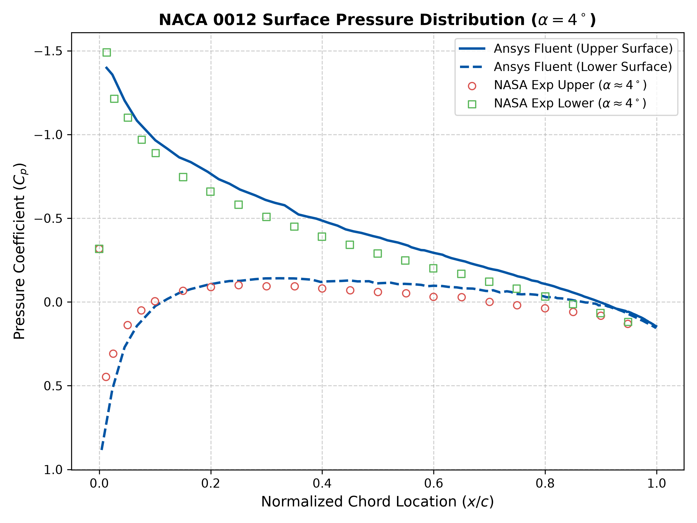
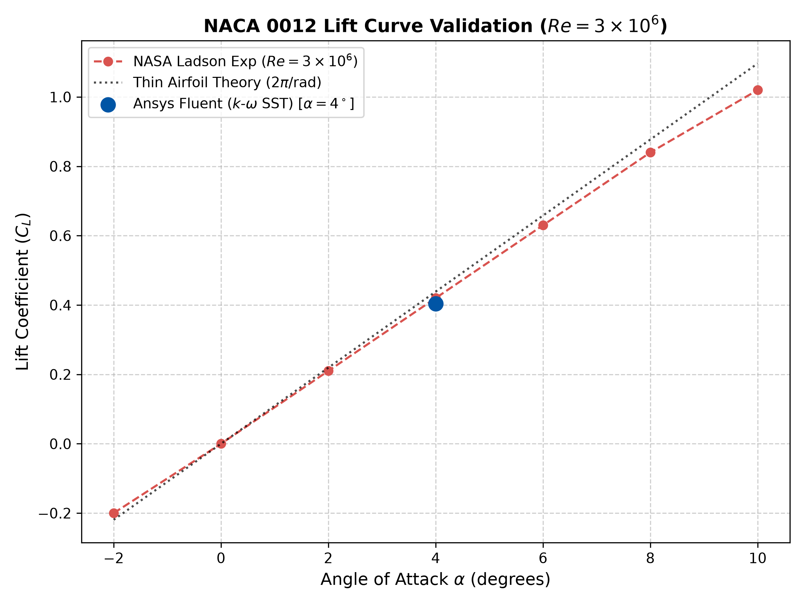
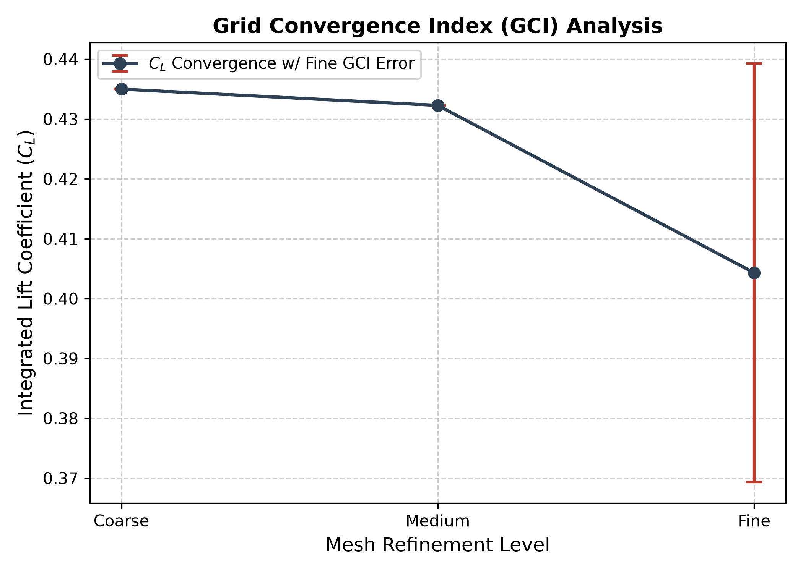
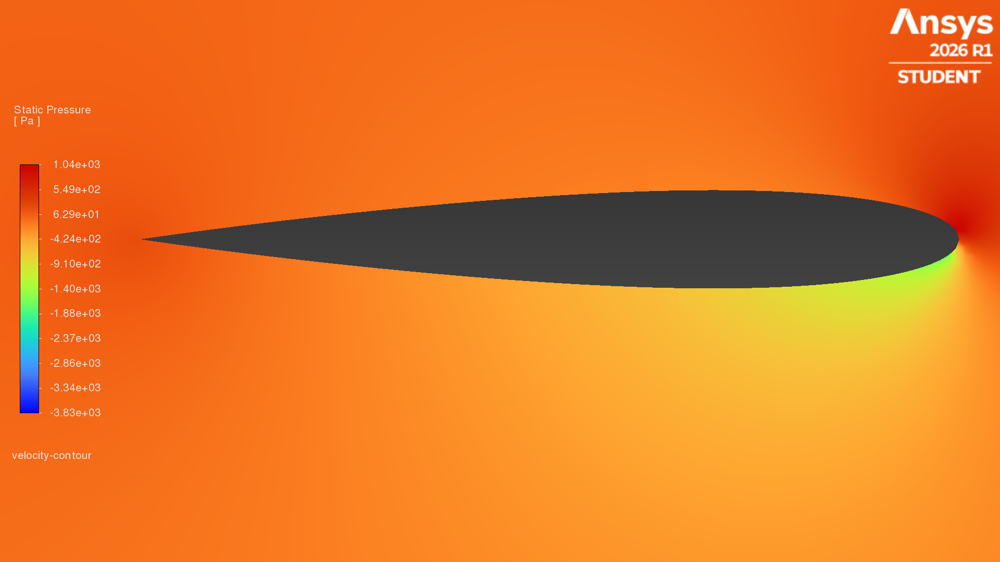
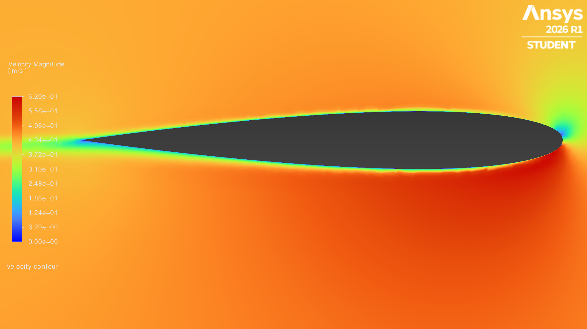

# NACA 0012 Airfoil CFD & Automated NASA Validation Pipeline
#### Video Demo: <PASTE_YOUR_YOUTUBE_URL_HERE>
#### Description:

An automated Python-based verification and validation (V&V) pipeline for 2D aerodynamic simulations of the NACA 0012 airfoil operating at $Re = 3 \times 10^6$ and $\alpha = 4^\circ$. The system parses raw CFD surface pressure exports from Ansys Fluent, benchmarks pressure coefficient distributions ($C_p$) against NASA Langley wind tunnel data (Ladson, 1988), and quantifies discretization uncertainty across three mesh densities using Roache’s Grid Convergence Index (GCI) per ASME V&V 20 standards.

### File Structure & Functionality
* `project.py`: The primary command-line interface and submission entry point. Executes the pipeline, runs validations, and coordinates figure rendering.
* `src/parser.py`: Handles file I/O, parsing raw CSV surface outputs from Fluent and structured space-delimited NASA benchmark `.dat` files into Pandas DataFrames.
* `src/metrics.py`: Contains numerical routines including trapezoidal numerical integration to calculate section lift ($C_L$) and GCI calculation functions to determine spatial discretization error.
* `src/visualization.py`: Generates publication-grade Matplotlib plots, exporting $C_p$ validation curves, $C_L-\alpha$ comparisons, and GCI convergence trends directly to `reports/figures/`.
* `test_project.py`: PyTest testing suite validating parser error handling, numerical integration accuracy, and metric thresholds.

### Key Design Choices
During development, I prioritized object oriented encapsulation using a custom dataset class (`SimulationDataset`) to keep physical state attributes organized. To ensure strict software reliability, I separated raw data transformation from visualization logic, enabling headless execution in continuous integration environments.

---

## Key Validation Highlights

<p align="center">
  
</p>

---

## Governing Physics & Numerical Methodology

### Incompressible RANS Formulation
The steady, two dimensional incompressible Reynolds-Averaged Navier-Stokes (RANS) equations govern the flow field:

$$\frac{\partial u_i}{\partial x_i} = 0$$

$$\rho u_j \frac{\partial u_i}{\partial x_j} = -\frac{\partial p}{\partial x_i} + \frac{\partial}{\partial x_j} \left[ \mu \left( \frac{\partial u_i}{\partial x_j} + \frac{\partial u_j}{\partial x_i} \right) - \rho \overline{u_i' u_j'} \right]$$

### Turbulence Modeling & Wall Resolution
* **$k\text{-}\omega$ SST Model**: Menter's Shear Stress Transport model blends $k\text{-}\omega$ near the wall with $k\text{-}\epsilon$ in the far field to resolve boundary layer separation under adverse pressure gradients.
* **Wall Distance**: Dimensionless wall distance $y^+ < 1.0$ is maintained across the fine surface mesh to directly resolve the viscous sublayer without wall functions.

### Surface Pressure Integration
Lift coefficient ($C_L$) is integrated independently via the trapezoidal rule over normalized chord coordinates ($x/c$):

$$C_L \approx \int_{0}^{1} (C_{p,\text{lower}} - C_{p,\text{upper}}) \, d\left(\frac{x}{c}\right)$$

---

## Verification & Validation Results

<p align="center">
  
  
</p>

---

## Ansys Fluent Field Contours ($\alpha = 4^\circ$, $Re = 3 \times 10^6$)

<p align="center">
  
  
</p>

* **Static Pressure Contour (Left):** Illustrates the high-pressure stagnation region at the leading edge ($C_p \approx 1.0$) and strong upper-surface suction peak driving section lift.
* **Velocity Magnitude Contour (Right):** Demonstrates boundary layer acceleration over the upper surface and the development of the viscous trailing-edge wake.

---

### Grid Convergence Index (GCI) Verification
Discretization uncertainty was evaluated across three systematically refined structured meshes (refinement ratio $r \approx 1.5$) per ASME V&V 20 guidelines:

| Mesh Level | Cell Count | Integrated $C_L$ | Max $y^+$ | Relative Error ($e_a$) | Fine Mesh GCI ($\text{GCI}_{\text{fine}}$) |
| :--- | :--- | :--- | :--- | :--- | :--- |
| **Coarse** | ~25,000 | 0.43500 | N/A | — | — |
| **Medium** | ~55,000 | 0.43228 | N/A | 0.63% | — |
| **Fine** | ~120,000 | 0.40431 | 0.929 | 6.92% | **8.65%** |

### Experimental Validation Summary
Validation was conducted at angle of attack $\alpha = 4^\circ$ and Reynolds number $Re = 3 \times 10^6$:

1. **Surface Pressure ($C_p$)**: Python integration confirms close agreement between Ansys Fluent CFD predictions and NASA Langley experimental pressure taps across suction and pressure surfaces.
2. **Lift Slope**: The fine-mesh prediction ($C_L = 0.40431$) reflects viscous decambering effects observed in experimental wind tunnel data compared to inviscid Thin Airfoil Theory ($2\pi / \text{rad}$).

---

## Repository Structure

```text
naca0012-cfd-python-validation/
├── data/
│   ├── benchmark/          # NASA Ladson CP_Ladson.dat data
│   └── raw/                # Fluent surface pressure & y+ CSV exports
├── reports/
│   └── figures/            # Exported high-res validation plots
│       └── validation_summary.csv
├── src/
│   ├── dataset.py          # SimulationDataset OOP module
│   ├── metrics.py          # Trapezoidal integration & GCI functions
│   ├── parser.py           # Ansys CSV & NASA dat parsing routines
│   └── visualization.py    # Matplotlib figure generation functions
├── project.py              # Primary CLI application (CS50P entry point)
├── test_project.py         # PyTest unit testing suite
└── requirements.txt        # Clean python dependency specifications
```
---

## Quickstart & CLI Usage

### 1. Install Dependencies
```bash
pip install -r requirements.txt
```
### 2. Generate Validation Pipeline & Figures
```bash
python project.py --export-plots